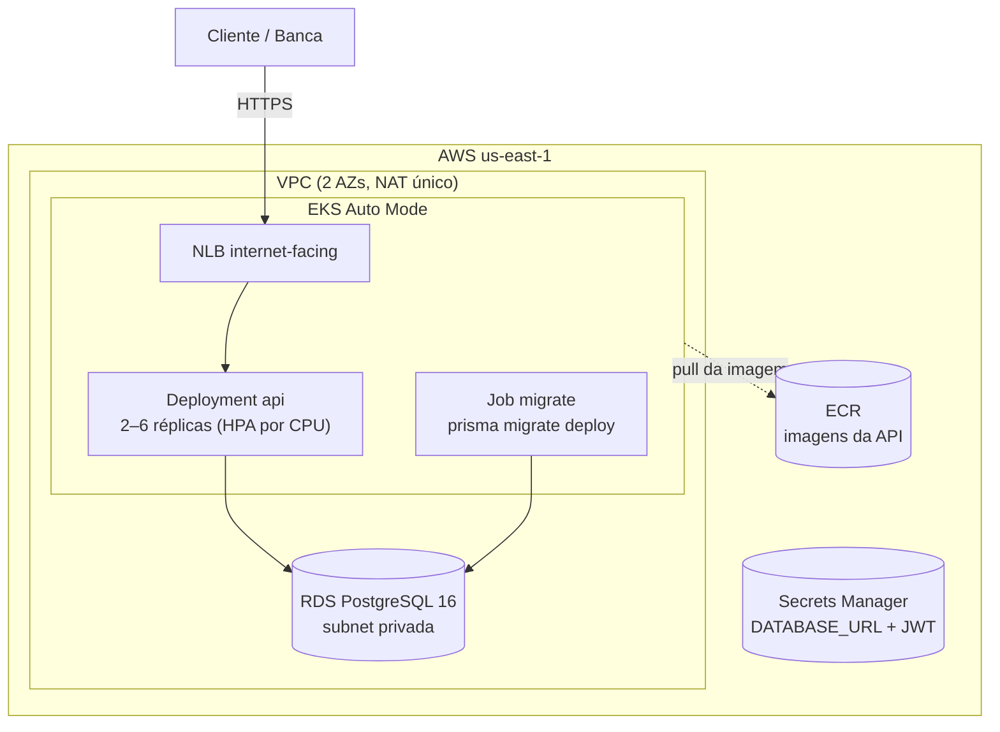
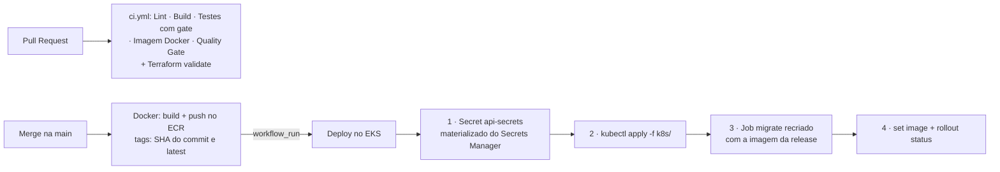

# Tech Challenge — Oficina Mecânica (Fase 2)

Sistema de gestão de ordens de serviço, clientes, veículos e estoque para uma oficina mecânica. Back-end NestJS com **Clean Architecture**, empacotado em **Kubernetes (EKS)**, com infraestrutura provisionada por **Terraform** e **CI/CD completo** no GitHub Actions.

**Objetivos desta fase:** refatorar a Fase 1 para Clean Architecture, containerizar e orquestrar em K8s com escalabilidade automática (HPA), provisionar cluster e banco via IaC, e automatizar build → testes → imagem → deploy.

- 🎥 **Vídeo demonstrativo:** _link será adicionado na entrega_
- 📚 **Documentação completa:** [`docs/`](docs/README.md) · **Collection das APIs:** Swagger em `/docs` (OpenAPI em `/docs-json`, importável no Postman/Insomnia)

## Arquitetura

### Infraestrutura provisionada (AWS)



| Componente | Onde é definido | Papel |
|---|---|---|
| VPC, EKS Auto Mode, RDS, Secrets Manager | [`infra/terraform/cluster/`](infra/terraform/cluster/) | Stack **efêmera** — sobe para demonstrar, desce para não custar |
| ECR + OIDC GitHub↔AWS + role do CI | [`infra/terraform/base/`](infra/terraform/base/) | Stack **permanente** (~US$ 0/mês) |
| Namespace, Deployment, Service NLB, HPA, Job de migration | [`k8s/`](k8s/README.md) | Estado declarativo aplicado a cada deploy |
| Postgres local + Secret de exemplo | [`k8s/local/`](k8s/) | Só para desenvolvimento (kind) |

Decisões e trade-offs (EKS Auto Mode, RDS vs StatefulSet, NLB via `loadBalancerClass`, migration em Job separado, non-root): [`docs/01-arquitetura.md`](docs/01-arquitetura.md) e READMEs de [`infra/terraform/`](infra/terraform/README.md) e [`k8s/`](k8s/README.md).

### Fluxo de deploy (CI/CD)



A autenticação do CI na AWS é **OIDC** — nenhuma access key guardada em secret do GitHub. Detalhes de cada workflow: [`docs/07-ci-cd.md`](docs/07-ci-cd.md).

## Stack

- NestJS 11 + TypeScript (Clean Architecture: `domain` / `application` / `infrastructure` por módulo)
- PostgreSQL 16 + Prisma ORM · JWT · Swagger/OpenAPI · Jest
- Docker + docker-compose (dev) · Kubernetes (kind local / EKS produção)
- Terraform ≥ 1.10 (backend S3 com lock nativo) · GitHub Actions

## Execução local (docker-compose)

Único pré-requisito: Docker.

```bash
git clone https://github.com/pedruvaz/tech-challenge-fiap.git && cd tech-challenge-fiap
cp .env.example .env   # preencha os segredos JWT (qualquer string em dev)
docker compose up -d --build
```

Sobe **API** (<http://localhost:3000>, Swagger em [/docs](http://localhost:3000/docs)), **PostgreSQL** (`localhost:5432`) e **pgAdmin** (<http://localhost:5050>, `admin@oficina.com` / `admin`). As migrations rodam no boot do container; o seed é manual:

```bash
docker compose exec api npx prisma db seed
```

Login no Swagger: `POST /auth/login` com `{ "email": "admin@oficina.com", "senha": "senha123" }` → botão **Authorize** → cole o `accessToken`.

| Email | Senha | Role |
| --- | --- | --- |
| `admin@oficina.com` | `senha123` | `admin` |
| `joao.mecanico@oficina.com` | `senha123` | `mecanico` |
| `carlos.mecanico@oficina.com` | `senha123` | `mecanico` |

Desenvolvimento com hot reload, variáveis de ambiente e comandos de banco: [`docs/04-execucao.md`](docs/04-execucao.md).

## Deploy em Kubernetes

**Local (kind):** passo a passo completo em [`k8s/README.md`](k8s/README.md) — build da imagem, `kind load`, apply na ordem (namespace → config/secret → postgres → Job de migration → API → HPA) e acesso via port-forward.

**EKS (produção da fase):** o deploy é feito pela pipeline (workflow **Deploy**), nunca à mão. Pré-requisito: infraestrutura aplicada e os secrets/vars do repositório configurados (tabela no cabeçalho de [`.github/workflows/deploy.yml`](.github/workflows/deploy.yml)). O disparo é automático a cada merge na `main`, ou manual em *Actions → Deploy → Run workflow* com uma tag de imagem específica.

## Provisionamento da infraestrutura (Terraform)

Guia completo com bootstrap, custos e ordem de aplicação: [`infra/terraform/README.md`](infra/terraform/README.md).

```bash
# uma vez: bucket de state (nome no versions.tf) + aws configure

cd infra/terraform/base      # ECR + OIDC — fica de pé (~US$ 0)
terraform init && terraform apply

cd ../cluster                # VPC + EKS + RDS + Secrets — sobe e desce
terraform init && terraform apply
# ao final da sessão de demonstração:
terraform destroy
```

> A `cluster/` ligada 24/7 custaria ~US$ 160/mês; uma sessão de 4h sai por ~US$ 1. Os ajustes que garantem o `destroy` limpo (RDS sem deletion protection, secret com recovery window zero) estão comentados no código.

## CI/CD

Build, lint, testes e imagem vivem num workflow só (`ci.yml`), em jobs paralelos:

| Job (`ci.yml`) | Quando roda | O que garante |
|---|---|---|
| Build · Lint | PR e push (`main`, `dev`) | Compilação TypeScript · ESLint |
| Testes | PR e push | Unitários **com gate de cobertura** (piso global 95/80/95/95) + e2e com Postgres real |
| Build da imagem Docker | PR e branches fora da `main` | A aplicação containeriza; compose válido |
| Push para o ECR | Push na `main` | Publica `SHA` + `latest` via OIDC, sem access key |
| Quality Gate | Sempre | Agrega os cinco; `skipped` só nos dois casos previstos |

| Workflow | Quando roda | O que garante |
|---|---|---|
| Terraform | PR/push que toca `infra/terraform/**` | `fmt -check` + `validate` nas stacks `base` e `cluster` |
| Deploy | Após a CI na `main`, ou manual | URLs públicas no ConfigMap + migration + manifests + rollout no EKS |

## Estrutura do repositório

```text
.
├── src/
│   ├── modules/<dominio>/       # Clean Architecture por módulo:
│   │   ├── domain/              #   entities, value objects, exceptions, portas
│   │   ├── application/         #   use cases (puros, sem framework)
│   │   └── infrastructure/      #   http (controllers/DTOs) + persistence (Prisma)
│   ├── auth/ · middleware/ · prisma/ · shared/
│   └── main.ts · app.module.ts
├── prisma/                      # schema, migrations, seed
├── k8s/                         # manifests (+ jobs/ e local/)
├── infra/terraform/             # base/ (ECR+OIDC) e cluster/ (VPC+EKS+RDS)
├── .github/workflows/           # lint, build, test, docker, terraform, deploy
└── docs/                        # documentação por tema (índice em docs/README.md)
```

## Grupo

- **Grupo:** 66
- **Integrantes:** Nayara, Pedro, Matheus, Guilherme e Aléxia
