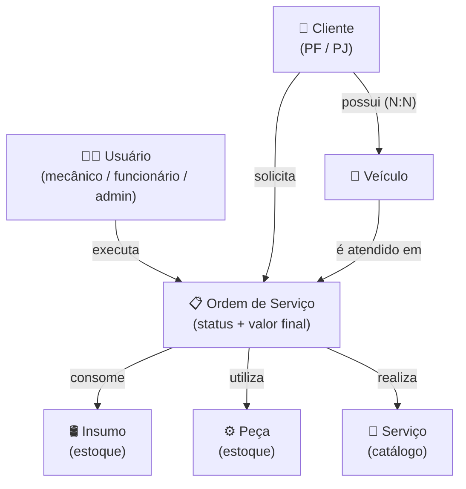
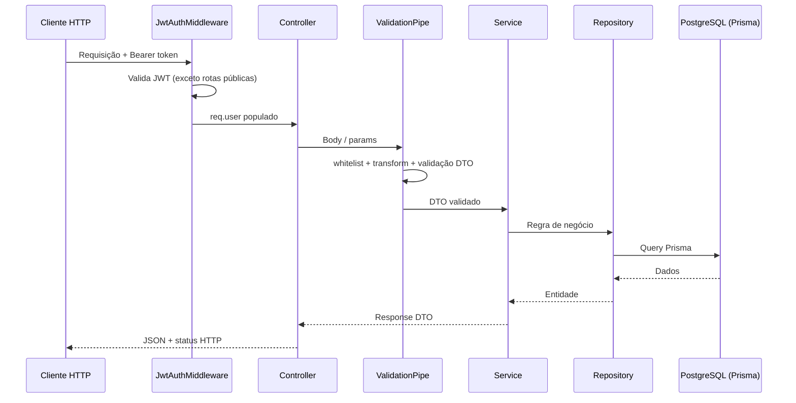

# 1 · Arquitetura

> [← Voltar ao índice](./README.md)

## Visão geral

O projeto é uma **API REST** construída com **NestJS** e organizada em torno do **Domain-Driven Design (DDD)**. Cada subdomínio de negócio vive em seu próprio módulo dentro de `src/domains/`, mantendo a separação de responsabilidades entre **controller → service → repository**.

A persistência é feita com **Prisma ORM** sobre **PostgreSQL**, exposto à aplicação como um serviço global (`PrismaModule`). A segurança é centralizada em um **middleware JWT** aplicado a todas as rotas, com poucas exceções públicas.

## Por que essas tecnologias?

### Por que NestJS?

- **Arquitetura modular nativa:** o sistema de módulos do Nest combina diretamente com a modularização por domínio (DDD) adotada no projeto, mantendo cada subdomínio coeso e independente.
- **Injeção de dependências de primeira classe:** facilita o desacoplamento entre camadas (controller → service → repository) e simplifica os testes com mocks.
- **TypeScript de ponta a ponta:** tipagem forte em toda a aplicação, reduzindo erros em tempo de execução e melhorando a manutenibilidade.
- **Recursos integrados:** `ValidationPipe`, middlewares, guards, `ConfigModule` e integração com Swagger vêm prontos, evitando reinventar infraestrutura comum.
- **Opinativo e padronizado:** impõe uma estrutura consistente, o que reduz a curva de entrada para novos integrantes da equipe.
- **Ecossistema maduro:** ampla documentação, comunidade ativa e integração simples com bibliotecas como Prisma e JWT.

### Por que PostgreSQL?

- **Banco relacional robusto:** o domínio é fortemente relacional (cliente, veículo, ordem de serviço, peças, insumos), e o modelo relacional expressa naturalmente essas relações e garante integridade referencial.
- **Conformidade ACID:** garante consistência das transações, essencial para operações como abertura de ordens de serviço e baixa de estoque.
- **Open source e sem custo de licença:** maduro, confiável e amplamente adotado no mercado.
- **Recursos avançados:** suporte a tipos ricos (enums, JSON), constraints, índices e queries complexas atendem às necessidades atuais e futuras do projeto.
- **Ótima integração com Prisma:** o PostgreSQL é um dos bancos com melhor suporte no Prisma, incluindo migrations e geração de tipos.
- **Facilidade em desenvolvimento:** sobe rapidamente via Docker Compose (junto ao pgAdmin), padronizando o ambiente entre os integrantes.

## Estilo arquitetural

- **Modularização por domínio (DDD):** cada agregado de negócio (`cliente`, `veiculo`, `usuario`, etc.) é um módulo independente e coeso.
- **Camadas bem definidas** dentro de cada domínio:

| Camada | Responsabilidade | Exemplo |
| ------ | ---------------- | ------- |
| **Controller** | Expõe os endpoints HTTP, valida entrada (DTOs) e documenta a API (Swagger) | `cliente.controller.ts` |
| **Service** | Concentra as regras de negócio e orquestra o repositório | `cliente.service.ts` |
| **Repository** | Encapsula o acesso a dados via Prisma | `cliente.repository.ts` |
| **DTO** | Define o contrato de entrada/saída e as regras de validação | `dto/create-cliente.dto.ts` |

- **Validação centralizada:** um `ValidationPipe` global (em `main.ts`) aplica `whitelist`, `forbidNonWhitelisted` e `transform` a todas as requisições.
- **Configuração via ambiente:** o `ConfigModule` (global) carrega o `.env`, evitando segredos no código.

## Estrutura de pastas

```text
.
├── src/
│   ├── main.ts                      # bootstrap: ValidationPipe global + Swagger
│   ├── app.module.ts                # módulo raiz: registra ConfigModule, JwtModule, domínios e middleware
│   ├── app.controller.ts            # health check da raiz "/"
│   │
│   ├── auth/                        # autenticação JWT
│   │   ├── auth.controller.ts       # login, refresh, logout
│   │   ├── auth.service.ts          # geração/validação de tokens, bcrypt
│   │   ├── dto/                     # login.dto, refresh-token.dto
│   │   └── types/                   # jwt-payload, token-pair
│   │
│   ├── middleware/
│   │   └── jwt-auth.middleware.ts   # valida o Bearer token em todas as rotas protegidas
│   │
│   ├── common/
│   │   └── validators/
│   │       └── cpf-cnpj.validator.ts # validação customizada de CPF/CNPJ
│   │
│   ├── domains/                     # subdomínios de negócio (DDD)
│   │   ├── cliente/                 # controller + service + repository + dto + test
│   │   ├── veiculo/
│   │   ├── usuario/
│   │   ├── pecas/
│   │   ├── insumos/
│   │   └── servico/
│   │
│   └── prisma/
│       ├── prisma.service.ts        # PrismaClient como serviço NestJS
│       └── prisma.module.ts         # módulo global do Prisma
│
├── prisma/
│   ├── schema.prisma                # models, enums e relações
│   ├── migrations/                  # histórico de migrations (versionado no git)
│   └── seed.ts                      # carga inicial de dados
│
├── docker-compose.yml               # PostgreSQL + pgAdmin (+ api) para desenvolvimento
├── Dockerfile                       # build multi-stage para produção
└── .nvmrc                           # versão do Node (v22.18.0)
```

## Mapa de domínio (Domain Mapping)

O diagrama abaixo mostra os agregados do domínio e como se relacionam. A **Ordem de Serviço** é o agregado central: conecta o cliente, o veículo, o mecânico e os itens consumidos (peças, insumos e serviços).



## Fluxo de uma requisição



## Autenticação e autorização

A autenticação usa **JWT com par de tokens** (access + refresh):

- **Access token** — curta duração; enviado no header `Authorization: Bearer <token>`.
- **Refresh token** — longa duração; armazenado com **hash bcrypt** na coluna `refresh_token` do usuário, permitindo **revogação** (logout) e **rotação** a cada renovação.

O `JwtAuthMiddleware` é aplicado a **todas as rotas** (`forRoutes('*')`), com as seguintes **exceções públicas**:

| Rota | Método | Por quê |
| ---- | ------ | ------- |
| `/` | `GET` | Health check |
| `/auth/login` | `POST` | Obtenção inicial de tokens |
| `/auth/refresh` | `POST` | Renovação de tokens |

As senhas são armazenadas com **hash bcrypt** e nunca retornadas pela API (os DTOs de resposta omitem `senha` e `refreshToken`).

> Os segredos e tempos de expiração são configurados via `.env`: `JWT_ACCESS_SECRET`, `JWT_ACCESS_EXPIRES_IN`, `JWT_REFRESH_SECRET`, `JWT_REFRESH_EXPIRES_IN`.

## Decisões de projeto

- **Prisma como camada de persistência única**, exposto globalmente para evitar boilerplate de injeção em cada módulo.
- **Soft delete** em todas as entidades de negócio (coluna `deletado_em`), preservando histórico.
- **Validação de CPF/CNPJ** isolada em um validador reutilizável (`common/validators`), mantendo os DTOs limpos.
- **Migrations versionadas** no git — qualquer integrante reproduz o banco com `npx prisma migrate deploy`.
