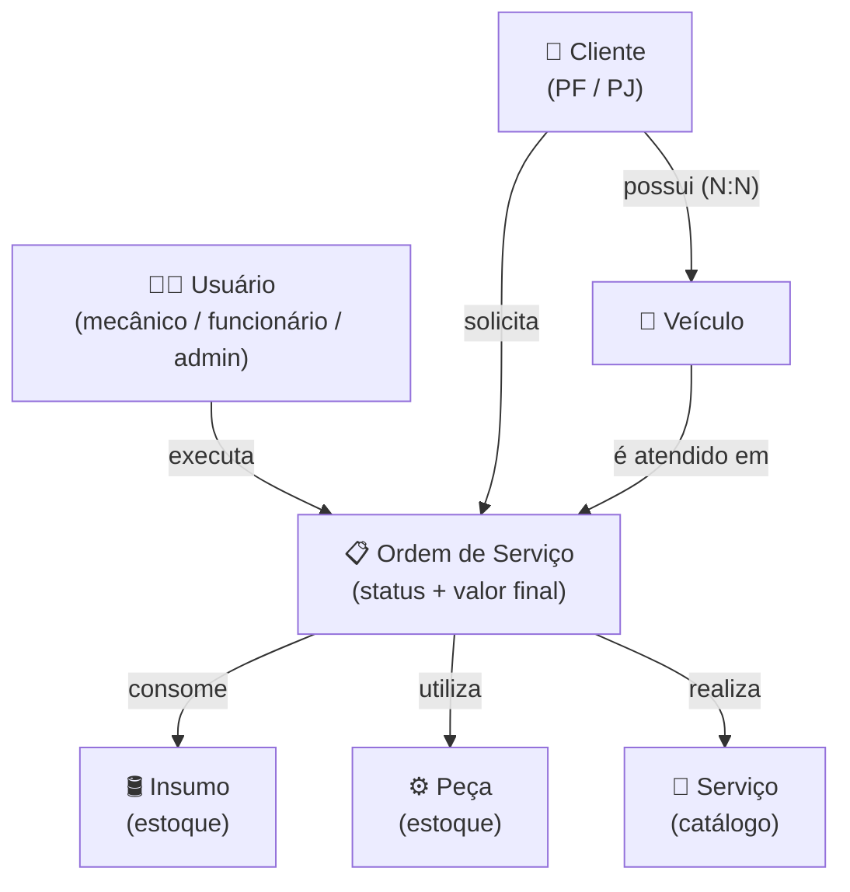
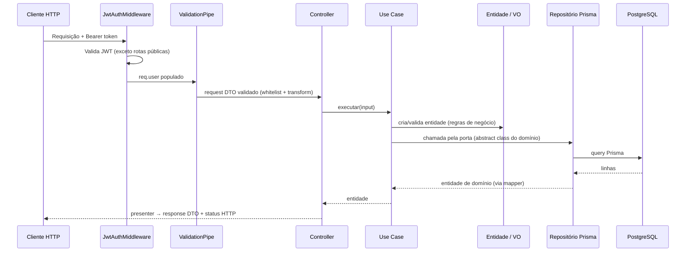
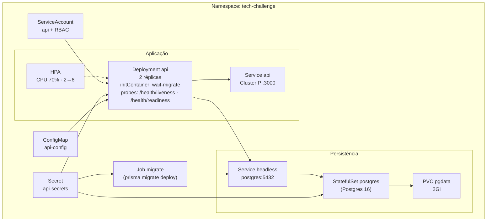

# 1 · Arquitetura

> [← Voltar ao índice](./README.md)

## Visão geral

O projeto é uma **API REST** construída com **NestJS** e organizada em **Clean Architecture** (refatoração feita na Fase 2). Cada subdomínio de negócio vive em seu próprio módulo dentro de `src/modules/`, com três camadas — **domain**, **application** e **infrastructure** — e a regra de dependência apontando sempre para o domínio.

A persistência é feita com **Prisma ORM** sobre **PostgreSQL**, exposto à aplicação como um serviço global (`PrismaModule`). A segurança é centralizada em um **middleware JWT** aplicado a todas as rotas, com poucas exceções públicas.

## Por que essas tecnologias?

### Por que NestJS?

- **Arquitetura modular nativa:** o sistema de módulos do Nest combina diretamente com a modularização por domínio (DDD) adotada no projeto, mantendo cada subdomínio coeso e independente.
- **Injeção de dependências de primeira classe:** é o que liga as portas do domínio aos adapters de infraestrutura (`useClass`/`useFactory` nos módulos), sem que domain e application conheçam o framework.
- **TypeScript de ponta a ponta:** tipagem forte em toda a aplicação, reduzindo erros em tempo de execução e melhorando a manutenibilidade.
- **Recursos integrados:** `ValidationPipe`, middlewares, guards, `ConfigModule` e integração com Swagger vêm prontos, evitando reinventar infraestrutura comum.
- **Opinativo e padronizado:** impõe uma estrutura consistente, o que reduz a curva de entrada para novos integrantes da equipe.
- **Ecossistema maduro:** ampla documentação, comunidade ativa e integração simples com bibliotecas como Prisma e JWT.

### Por que PostgreSQL?

- **Banco relacional robusto:** o domínio é fortemente relacional (cliente, veículo, ordem de serviço, peças, insumos), e o modelo relacional expressa naturalmente essas relações e garante integridade referencial.
- **Conformidade ACID:** garante consistência das transações, essencial para operações como abertura de ordens de serviço e baixa de estoque.
- **Open source e sem custo de licença:** maduro, confiável e amplamente adotado no mercado.
- **Recursos avançados:** suporte a tipos ricos (enums, JSON), constraints, índices e queries complexas atendem às necessidades atuais e futuras do projeto.
- **Ótima integração com Prisma:** o PostgreSQL é um dos bancos com melhor suporte no Prisma, incluindo migrations e geração de tipos.
- **Facilidade em desenvolvimento:** sobe rapidamente via Docker Compose (junto ao pgAdmin), padronizando o ambiente entre os integrantes.

## Estilo arquitetural

- **Clean Architecture por módulo:** cada subdomínio (`cliente`, `veiculo`, `ordem-servico`, etc.) vive em `src/modules/<dominio>/` com três camadas. A dependência aponta sempre para dentro — infrastructure → application → domain; o domínio não importa nada de NestJS nem de Prisma.

| Camada | Responsabilidade | Exemplo |
| ------ | ---------------- | ------- |
| **Domain** | Entidades e value objects com as regras de negócio, exceptions de domínio e as **portas** (abstract classes) que a infra implementa | `domain/entities/cliente.entity.ts` |
| **Application** | Use cases que orquestram entidades e portas — classes puras, sem `@Injectable` | `application/use-cases/criar-cliente.use-case.ts` |
| **Infrastructure (http)** | Controllers, request/response DTOs e presenters (entidade → JSON), documentação Swagger | `infrastructure/http/cliente.controller.ts` |
| **Infrastructure (persistence)** | Repositórios Prisma que implementam as portas + mappers linha ↔ entidade | `infrastructure/persistence/prisma-cliente.repository.ts` |

- **Portas como `abstract class`:** o domínio declara o contrato (ex.: `ClienteRepository`) e ele mesmo serve de token de injeção — interface TypeScript some em runtime e exigiria `@Inject` manual. O módulo NestJS de cada domínio faz o bind: `{ provide: ClienteRepository, useClass: PrismaClienteRepository }`.
- **Use cases sem framework:** instanciados via `useFactory` no módulo de cada domínio; a camada application é testada com stubs simples, sem `TestingModule`.
- **Erros de domínio → HTTP:** regras violadas lançam `DomainException` com um `kind`; o `DomainExceptionFilter` global converte o `kind` em status HTTP (tabela em [Fluxo de uma requisição](#fluxo-de-uma-requisição)).
- **Transação como porta:** o agregado `ordem-servico` define também `UnitOfWork`, implementada na infra com `$transaction` do Prisma (via `AsyncLocalStorage`), para operações que precisam de atomicidade entre vários repositórios.
- **Validação centralizada:** um `ValidationPipe` global (em `main.ts`) aplica `whitelist`, `forbidNonWhitelisted` e `transform` a todas as requisições.
- **Configuração via ambiente:** o `ConfigModule` (global) carrega o `.env`, evitando segredos no código.

## Estrutura de pastas

```text
.
├── src/
│   ├── main.ts                          # bootstrap: helmet, ValidationPipe + DomainExceptionFilter globais, Swagger
│   ├── app.module.ts                    # módulo raiz: ConfigModule, JwtModule, módulos de domínio e middleware JWT
│   ├── app.controller.ts                # health check da raiz "/"
│   │
│   ├── modules/                         # subdomínios de negócio (Clean Architecture)
│   │   ├── cliente/                     # todo módulo segue a mesma anatomia:
│   │   │   ├── domain/
│   │   │   │   ├── entities/            #   regras de negócio (cliente.entity.ts)
│   │   │   │   ├── value-objects/       #   VOs validados na construção (documento-cliente.vo.ts)
│   │   │   │   ├── exceptions/          #   DomainException + kind (documento-ja-cadastrado.exception.ts)
│   │   │   │   └── repositories/        #   portas — abstract classes (cliente.repository.ts)
│   │   │   ├── application/
│   │   │   │   └── use-cases/           #   1 arquivo por caso de uso (criar-cliente.use-case.ts)
│   │   │   └── infrastructure/
│   │   │       ├── http/                #   controller, dtos/ (request/response) e presenter
│   │   │       ├── persistence/         #   prisma-cliente.repository.ts + mappers/
│   │   │       └── cliente.module.ts    #   wiring NestJS: porta → adapter, use cases via factory
│   │   ├── veiculo/
│   │   ├── usuario/
│   │   ├── peca/
│   │   ├── insumo/
│   │   ├── servico/
│   │   ├── ordem-servico/               # agregado central; define também UnitOfWork e view de leitura
│   │   └── health/                      # probes liveness/readiness (só controller — sem camadas)
│   │
│   ├── shared/
│   │   ├── domain/                      # DomainException base + validação de documento e placa
│   │   └── infrastructure/http/         # DomainExceptionFilter (kind → status HTTP)
│   │
│   ├── auth/                            # login, refresh, logout — JWT + bcrypt
│   ├── middleware/                      # jwt-auth.middleware: valida o Bearer token nas rotas protegidas
│   ├── common/                          # decorators, pipes e validators reutilizáveis de DTO
│   └── prisma/                          # PrismaClient como serviço global NestJS
│
├── prisma/
│   ├── schema.prisma                    # models, enums e relações
│   ├── migrations/                      # histórico de migrations (versionado no git)
│   └── seed.ts                          # carga inicial de dados
│
├── k8s/                                 # manifests Kubernetes (ver seção abaixo)
├── infra/terraform/                     # IaC: base/ (ECR + OIDC) e cluster/ (VPC + EKS + RDS)
├── docker-compose.yml                   # PostgreSQL + pgAdmin (+ api) para desenvolvimento
└── Dockerfile                           # build multi-stage para produção
```

## Mapa de domínio (Domain Mapping)

O diagrama abaixo mostra os agregados do domínio e como se relacionam. A **Ordem de Serviço** é o agregado central: conecta o cliente, o veículo, o mecânico e os itens consumidos (peças, insumos e serviços).



## Fluxo de uma requisição



O controller não toca o Prisma nem contém regra de negócio: converte o request DTO no input do use case e o resultado no response DTO (presenter). O use case só conhece o domínio — recebe a porta no construtor e não sabe que a implementação é Prisma.

### Erros de domínio

Quando uma regra é violada (documento duplicado, transição de status inválida, estoque insuficiente…), a entidade ou o use case lança uma `DomainException` com um `kind`. O `DomainExceptionFilter` (global, registrado no `main.ts`) converte o `kind` em resposta HTTP — o domínio não conhece códigos de status:

| `kind` | Status HTTP |
| ------ | ----------- |
| `NOT_FOUND` | 404 |
| `INVALID_INPUT` | 400 |
| `CONFLICT` | 409 |
| `FORBIDDEN` | 403 |
| `UNAUTHORIZED` | 401 |

## Autenticação e autorização

A autenticação usa **JWT com par de tokens** (access + refresh):

- **Access token** — curta duração; enviado no header `Authorization: Bearer <token>`.
- **Refresh token** — longa duração; armazenado com **hash bcrypt** na coluna `refresh_token` do usuário, permitindo **revogação** (logout) e **rotação** a cada renovação.

O `JwtAuthMiddleware` é aplicado a **todas as rotas** (`forRoutes('*')`), com as seguintes **exceções públicas**:

| Rota | Método | Por quê |
| ---- | ------ | ------- |
| `/` | `GET` | Health check |
| `/auth/login` | `POST` | Obtenção inicial de tokens |
| `/auth/refresh` | `POST` | Renovação de tokens |
| `/publico/ordens-servico/:id` | `GET` | Consulta da OS pelo cliente, autenticada pelo CPF/CNPJ informado na query |
| `/health/liveness` | `GET` | Probe de liveness (Kubernetes) |
| `/health/readiness` | `GET` | Probe de readiness (Kubernetes) |

As senhas são armazenadas com **hash bcrypt** e nunca retornadas pela API (os DTOs de resposta omitem `senha` e `refreshToken`).

> Os segredos e tempos de expiração são configurados via `.env`: `JWT_ACCESS_SECRET`, `JWT_ACCESS_EXPIRES_IN`, `JWT_REFRESH_SECRET`, `JWT_REFRESH_EXPIRES_IN`.

## Decisões de projeto

- **Prisma como camada de persistência única**, exposto globalmente para evitar boilerplate de injeção em cada módulo.
- **Soft delete** em todas as entidades de negócio (coluna `deletado_em`), preservando histórico.
- **Validação de CPF/CNPJ e placa de veículo** isoladas em validadores reutilizáveis (`common/validators`), mantendo os DTOs limpos. A placa aceita os formatos antigo (`AAA-1234` / `AAA1234`) e Mercosul (`AAA1A23`).
- **Migrations versionadas** no git — qualquer integrante reproduz o banco com `npx prisma migrate deploy`.

## Execução em Kubernetes (Fase 2)

A API foi preparada para rodar em Kubernetes como parte da Fase 2 do Tech Challenge. Os manifestos declarativos ficam em [`/k8s`](../k8s/README.md).

### Componentes

| Recurso | Papel |
| ------- | ----- |
| `Namespace` `tech-challenge` | Isola todos os recursos. |
| `ServiceAccount` `api` + `Role`/`RoleBinding` | RBAC mínimo (`get/list/watch` de `jobs`) para o initContainer da API aguardar o Job de migrations. |
| `ConfigMap` `api-config` | Envs não sensíveis (`NODE_ENV`, `PORT`, expirações do JWT). |
| `Secret` `api-secrets` | Segredos (`JWT_*_SECRET`, credenciais do Postgres, `DATABASE_URL`). |
| `StatefulSet` `postgres` + PVC + Service headless | Banco autocontido no cluster (Postgres 16). |
| `Job` `migrate` | Roda `prisma migrate deploy` **uma vez por release**, evitando corrida entre réplicas. |
| `Deployment` `api` (2 réplicas) | initContainer `wait-migrate` (`kubectl wait job/migrate`), probes em `/health/liveness` e `/health/readiness`, `enableShutdownHooks()` no SIGTERM. |
| `Service` `api` (ClusterIP) | Expõe a API na porta 3000 dentro do cluster. |
| `HorizontalPodAutoscaler` | Escala por CPU (min=2, max=6, target 70%). |

### Diagrama



### Por que essas decisões

- **Probes** — `/health/liveness` é um `ok` puro; `/health/readiness` faz `SELECT 1` no Prisma. Se o probe de liveness checasse o DB e o Postgres travasse, o kubelet reiniciaria a API em loop; separar readiness resolve isso (a API sai do balanceamento até o DB voltar, mas não morre).
- **Graceful shutdown** — `app.enableShutdownHooks()` no `main.ts` faz o Nest responder ao `SIGTERM`. Sem isso, rolling updates e scale-down do HPA matam requests em voo.
- **Migration em Job separado** — com 2+ réplicas, o `CMD` original do Dockerfile (`migrate deploy && node dist/main`) faria N pods tentarem migrar em paralelo. O Job roda uma vez; o Deployment tem `initContainer` que espera o Job completar antes de subir.
- **Sem Ingress** — para a demo/avaliação, `kubectl port-forward svc/api 3000:3000` basta e evita dependência de ingress controller instalado.

Passo a passo de execução em [Execução do Projeto](./04-execucao.md#execução-em-kubernetes-kind).
