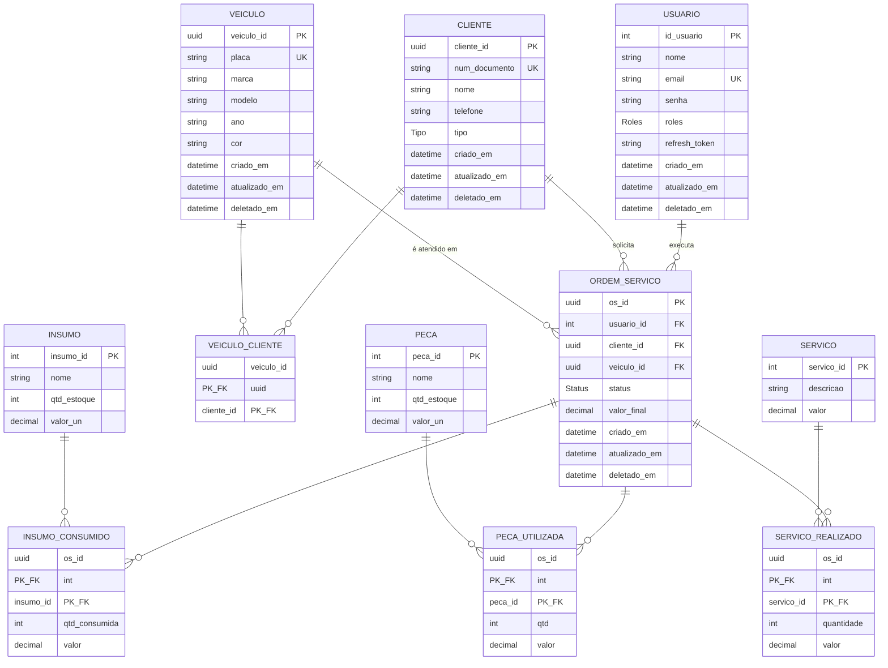

# 2 · Modelo de Dados

> [← Voltar ao índice](./README.md)

O modelo é definido em [`prisma/schema.prisma`](../prisma/schema.prisma) e materializado no PostgreSQL via migrations versionadas em `prisma/migrations/`.

## Diagrama Entidade-Relacionamento

## Enums

| Enum | Valores | Uso |
| ---- | ------- | --- |
| `Roles` | `admin`, `funcionario`, `mecanico` | Papel do usuário (padrão: `funcionario`) |
| `Tipo` | `pessoa_fisica`, `pessoa_juridica` | Tipo do cliente (define CPF ou CNPJ) |
| `Status` | `recebida`, `em_diagnostico`, `aguardando_aprovacao`, `em_execucao`, `finalizada`, `entregue` | Estágio da Ordem de Serviço (padrão: `recebida`) |

## Entidades

### Usuario (`usuario`)
Operadores do sistema (mecânicos, funcionários, administradores). A senha é armazenada com hash bcrypt; o `refresh_token` guarda o hash do token de renovação ativo.

### Cliente (`cliente`)
Pessoa física ou jurídica. O `num_documento` (CPF/CNPJ) é **único** e validado conforme o `tipo`. Possui veículos (N:N) e ordens de serviço.

### Veiculo (`veiculo`)
Veículo identificado pela `placa` (única). Pode pertencer a mais de um cliente ao longo do tempo (relação N:N via `veiculo_cliente`).

### VeiculoCliente (`veiculo_cliente`)
Tabela de junção que modela a relação **N:N** entre clientes e veículos. Chave primária composta (`veiculo_id`, `cliente_id`).

### OrdemServico (`ordem_servico`)
Agregado central. Vincula **mecânico** (usuário), **cliente** e **veículo**, controla o `status` e acumula o `valor_final` a partir dos itens consumidos.

### Insumo (`insumo`) e Peca (`peca`)
Itens de estoque com `qtd_estoque` e `valor_un`. Insumos são materiais de consumo (ex.: óleo); peças são componentes (ex.: filtro, pastilha).

### Servico (`servico`)
Catálogo de serviços oferecidos pela oficina, com `descricao` e `valor`.

### Tabelas de consumo (`insumo_consumido`, `peca_utilizada`, `servico_realizado`)
Relacionam a OS aos itens efetivamente usados, registrando **quantidade** e o **valor histórico** no momento do uso — preservando o preço cobrado mesmo que o catálogo/estoque mude depois.

## Convenções

- **Identificadores:** `Usuario`, `Insumo`, `Peca` e `Servico` usam `Int` autoincremento; `Cliente`, `Veiculo` e `OrdemServico` usam `UUID`.
- **Timestamps de auditoria:** `criado_em` (default `now()`), `atualizado_em` (`@updatedAt`).
- **Soft delete:** a coluna `deletado_em` (nullable) marca registros removidos sem apagá-los fisicamente — a API faz _soft delete_ nas operações de `DELETE`.
- **Mapeamento:** os campos em `camelCase` no schema Prisma são mapeados para `snake_case` no banco via `@map`/`@@map`.
- **Valores monetários:** `Decimal(10,2)`.
