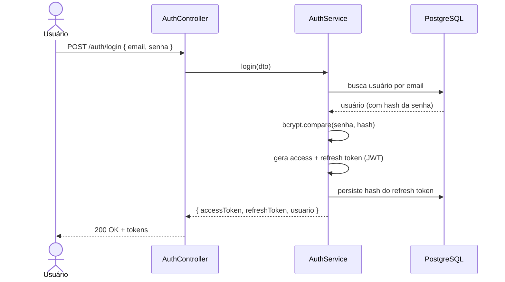
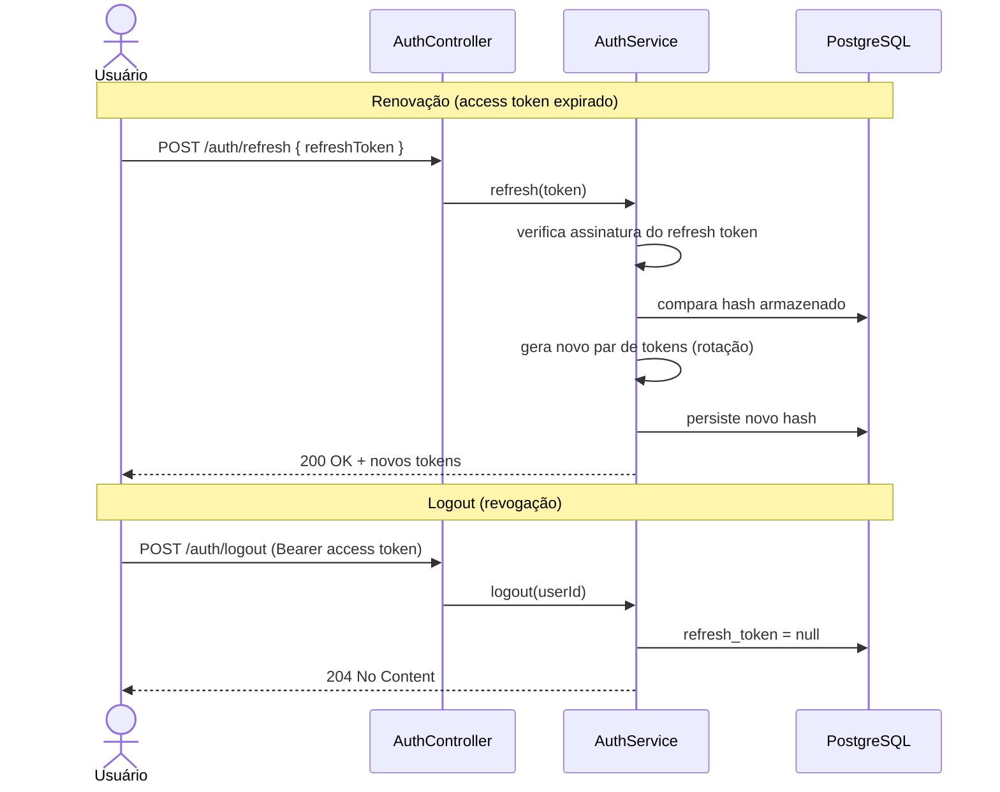
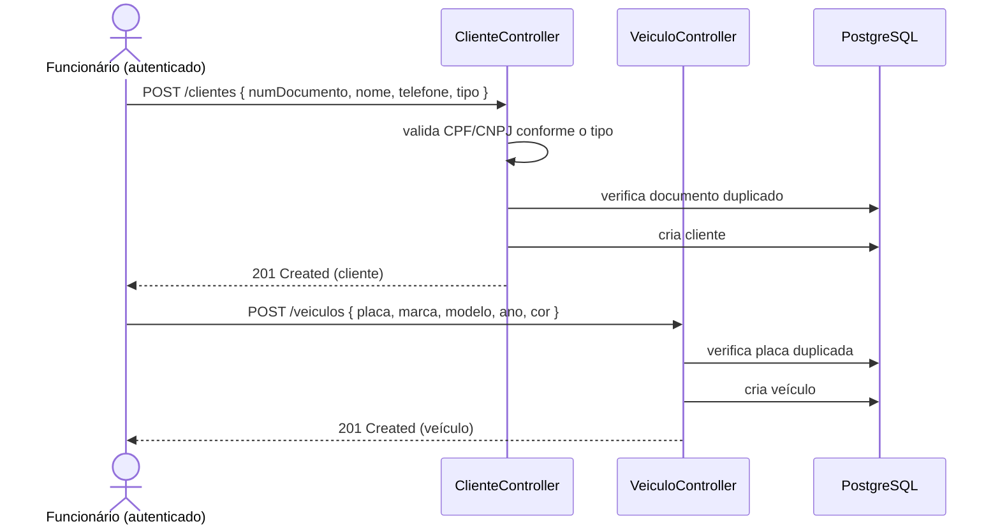
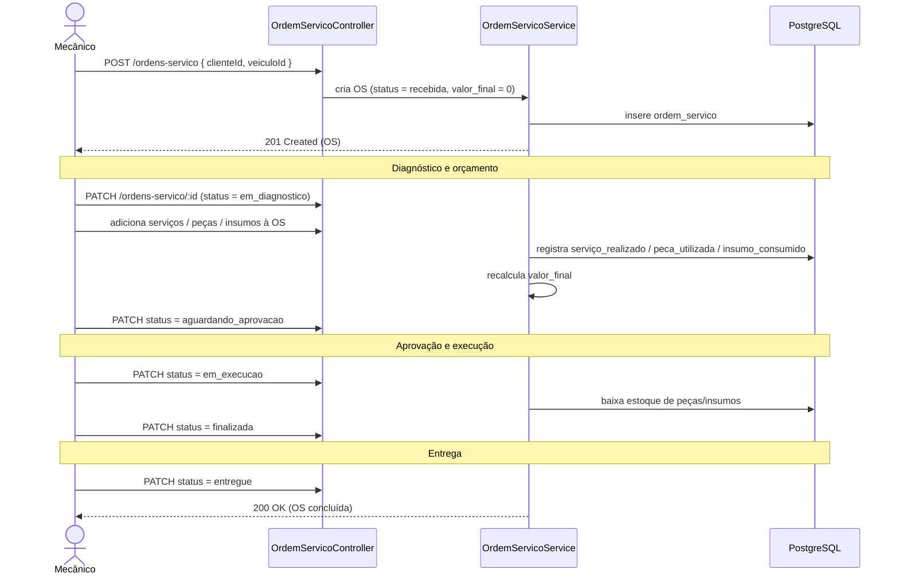
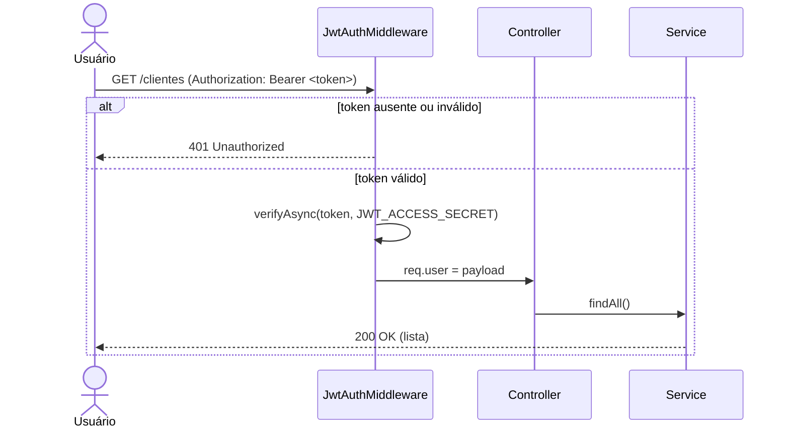

# 5 · Workflow de Execução das APIs

> [← Voltar ao índice](./README.md)

Esta seção descreve os principais fluxos de negócio em diagramas de sequência. Os exemplos cobrem desde a autenticação até o ciclo completo de uma Ordem de Serviço.

> ℹ️ Os fluxos de **autenticação** e **cadastros** (cliente, veículo, peça, insumo, serviço, usuário) já estão implementados. O fluxo de **Ordem de Serviço** representa o comportamento planejado, cujo modelo de dados já está pronto.

## 1. Autenticação (login)

Toda rota protegida exige um access token válido. O fluxo abaixo obtém o par de tokens.

## 2. Renovação e logout

## 3. Cadastro de cliente e veículo

Pré-requisito para abrir uma Ordem de Serviço.

## 4. Ciclo de uma Ordem de Serviço (planejado)

Fluxo de ponta a ponta: da abertura à entrega, com consumo de itens e cálculo do valor final.

## 5. Acesso a rota protegida

Como o middleware JWT participa de qualquer chamada autenticada.

