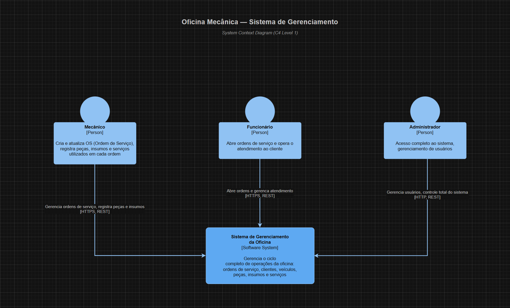
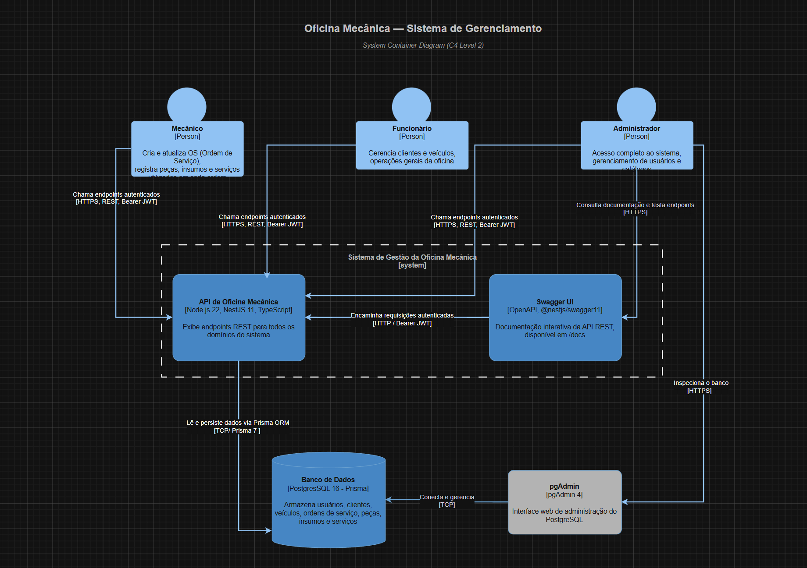
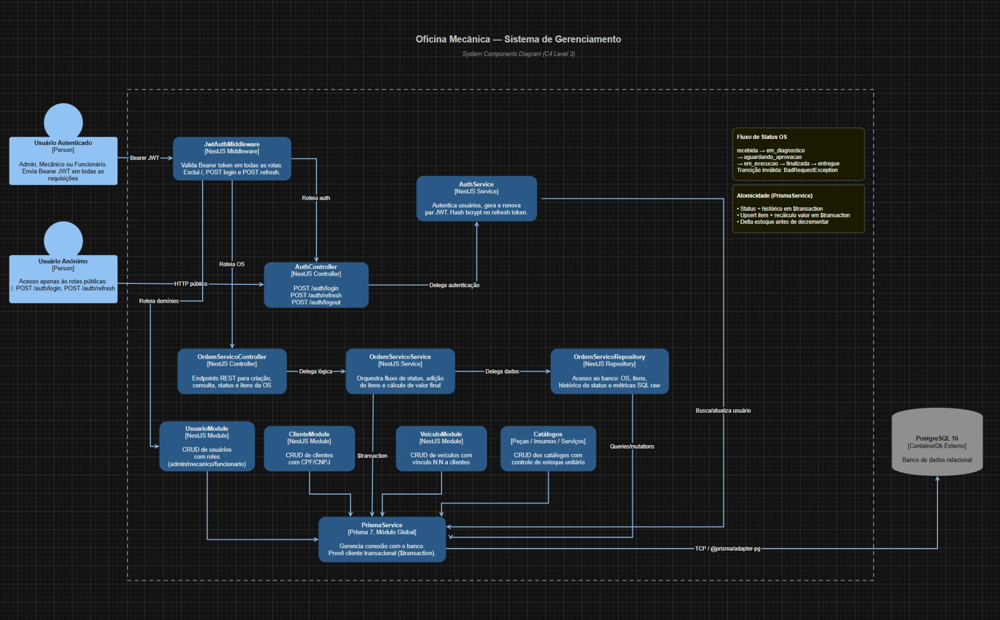
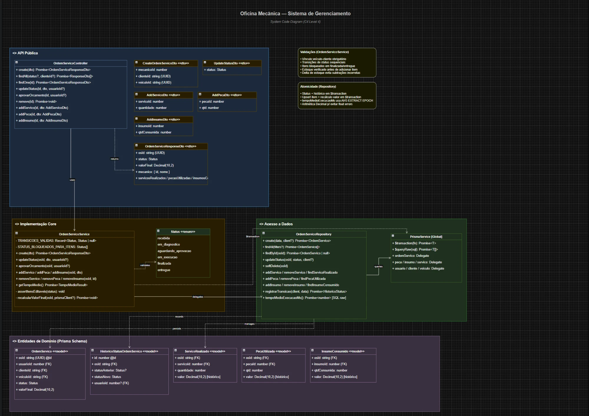

# 10 · Diagrama C4

> [← Voltar ao índice](./README.md)

## Visão geral

Os diagramas C4 mapeiam a arquitetura do sistema em quatro níveis de abstração progressiva, do contexto de negócio até o detalhe do código.

Os arquivos fonte estão na pasta [`docs/diagrams/`](./diagrams/) no formato **draw.io** (`.drawio`).

---

## Como visualizar os arquivos .drawio

### Opção 1 — draw.io Desktop (recomendado)
1. Baixe o [draw.io Desktop](https://github.com/jgraph/drawio-desktop/releases).
2. Abra o arquivo `.drawio` correspondente ao nível desejado.

### Opção 2 — draw.io Web
1. Acesse [app.diagrams.net](https://app.diagrams.net).
2. Escolha **Open from → Device** e selecione o arquivo `.drawio`.

### Opção 3 — GitHub (visualização nativa)
O GitHub renderiza arquivos `.drawio` diretamente. Basta clicar no arquivo no navegador de arquivos do repositório.

### Opção 4 — VS Code
Instale a extensão [Draw.io Integration](https://marketplace.visualstudio.com/items?itemName=hediet.vscode-drawio) e abra os arquivos diretamente no editor.

---

## Níveis

### C1 · Contexto do Sistema

> **Arquivo fonte:** [`docs/diagrams/c1-context.drawio`](./diagrams/c1-context.drawio)

Visão de alto nível que mostra o sistema de oficina mecânica e os atores externos (Mecânico, Funcionário e Administrador) que interagem com ele via HTTPS/REST.



---

### C2 · Containers

> **Arquivo fonte:** [`docs/diagrams/c2-containers.drawio`](./diagrams/c2-containers.drawio)

Detalha os containers que compõem o sistema: a API NestJS, o Swagger UI, o banco de dados PostgreSQL e o pgAdmin, e como os atores externos se conectam a cada um.



| Container | Tecnologia | Responsabilidade |
|-----------|-----------|-----------------|
| API REST | Node.js 22 · NestJS 11 · TypeScript | Lógica de negócio, autenticação, exposição de endpoints |
| Swagger UI | OpenAPI · `@nestjs/swagger` | Documentação interativa disponível em `/docs` |
| Banco de Dados | PostgreSQL 16 · Prisma 7 | Persistência de todas as entidades do sistema |
| pgAdmin | pgAdmin 4 | Interface web de administração do PostgreSQL |

---

### C3 · Componentes

> **Arquivo fonte:** [`docs/diagrams/c3-components.drawio`](./diagrams/c3-components.drawio)

Expande o container da API NestJS mostrando os módulos internos, o middleware JWT e como cada componente se comunica.



| Módulo | Componentes | Responsabilidade |
|--------|------------|-----------------|
| `AuthModule` | `JwtAuthMiddleware` · `AuthController` · `AuthService` | Autenticação, geração e renovação de JWT |
| `OrdemServicoModule` | Controller · Service · Repository | Workflow de OS, transições de status, cálculo de valor final |
| `UsuarioModule` | Controller · Service · Repository | CRUD de usuários com roles (admin/mecânico/funcionário) |
| `ClienteModule` | Controller · Service · Repository | CRUD de clientes PF/PJ com validação de CPF/CNPJ |
| `VeiculoModule` | Controller · Service · Repository | CRUD de veículos com vínculo N:N a clientes |
| Catálogos (`PecaModule`, `InsumoModule`, `ServicoModule`) | Controller · Service · Repository | CRUD dos catálogos com controle de estoque unitário |
| `PrismaModule` | `PrismaService` | Conexão global com o banco, cliente transacional (`$transaction`) |

---

### C4 · Código

> **Arquivo fonte:** [`docs/diagrams/c4-code.drawio`](./diagrams/c4-code.drawio)

Diagrama de classes das camadas de domínio, refletindo os DTOs, serviços, repositório e entidades do Prisma Schema, além das regras de validação e atomicidade.



Entidades principais e suas relações:

- **OrdemServico** → histórico em **HistoricoStatusOrdemServico**, possui muitos **ServicoRealizado**, **PecaUtilizada** e **InsumoConsumido**
- **OrdemServicoService** valida transições de status via `TRANSICOES_VALIDAS`
- **OrdemServicoRepository** executa operações atômicas via `$transaction` do Prisma

---

## Estrutura de arquivos

```
docs/
└── diagrams/
    ├── c1-context.drawio
    ├── c2-containers.drawio
    ├── c3-components.drawio
    └── c4-code.drawio

images/
├── c4-nivel1-context.png
├── c4-nivel2-containers.png
├── c4-nivel3-components.png
└── c4-nivel4-code.png
```
