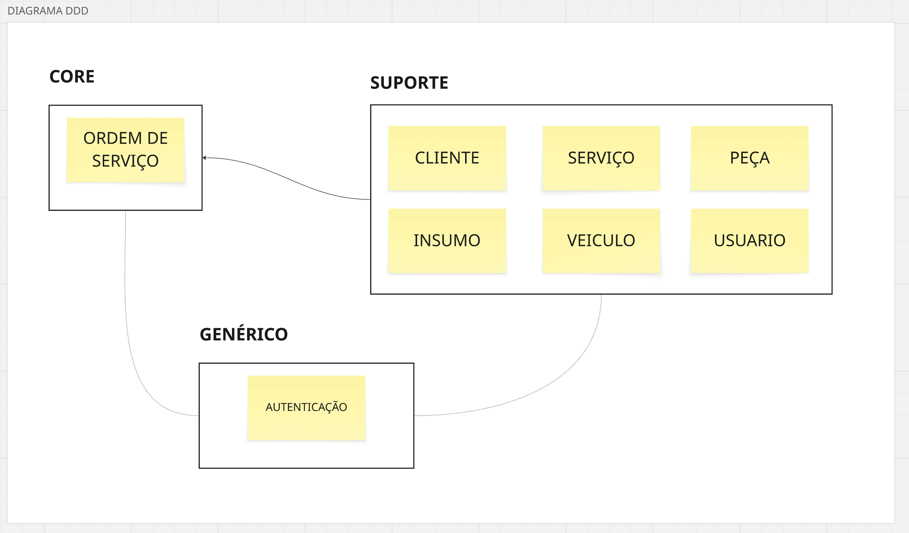

# DDD estratégico - Sistema de Gestão de Oficina Mecânica

## Domínio
Manutenção automotiva: receber veículos, diagnosticar problemas, executar reparos e devolver ao cliente. O sistema existe para organizar esse fluxo.

## Domain Experts
- **Dono da oficina** — visão de negócio: precificação, margem,
    fluxo de caixa, prioridades.
- **Mecânico** — execução: diagnóstico, conhecimento técnico de
    peças, insumos e procedimentos.
- **Atendente** — recepção: cadastro de cliente e veículo,
    comunicação e acompanhamento da OS.

## Subdomínios

### Core - Ordem de Serviço
É o coração do sistema: gerencia o ciclo de vida da OS (recebida → em diagnóstico → aguardando aprovação → em execução → finalizada → entregue), a composição de peças + insumos + serviços, o cálculo do valor final e a aprovação pelo cliente.

### Suporte
- **Cliente** — quem é dono ou responsável do veículo.
- **Veículo** — o bem que recebe o serviço.
- **Peça** — catálogo e controle de estoque.
- **Insumo** — catálogo e controle de estoque.
- **Serviço** — catálogo de mão de obra.
- **Usuário/Mecânico** — quem opera o sistema e executa a OS, com perfis de acesso.

### Genérico
- **Autenticação** (JWT, refresh token, perfis de acesso)

## Diagrama
