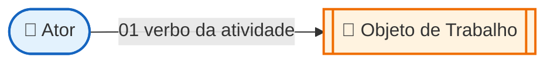
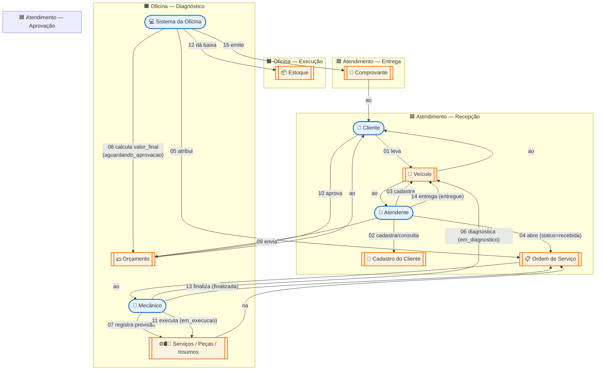
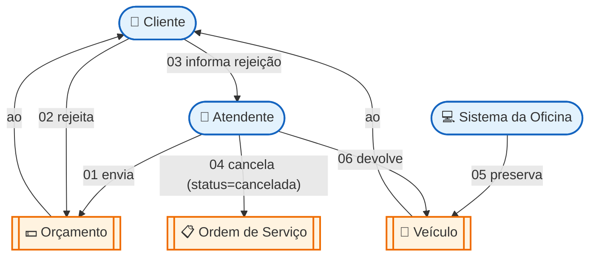
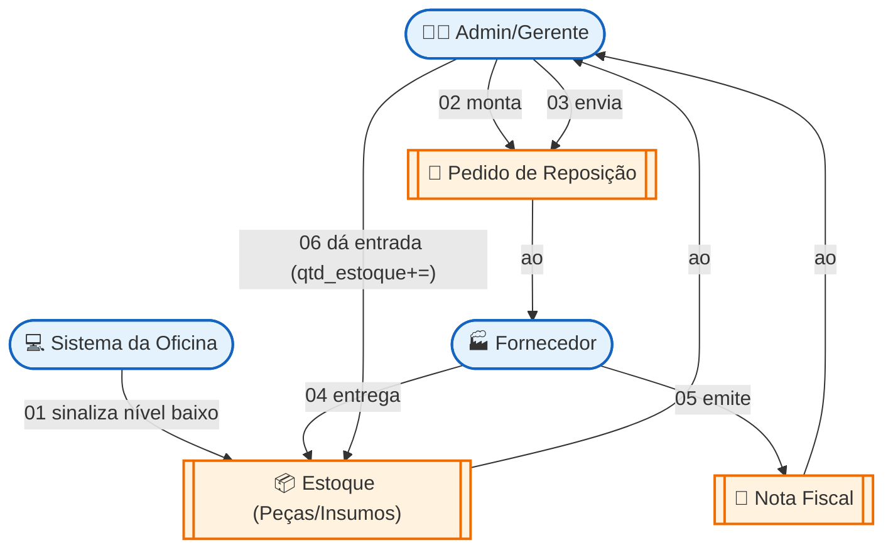
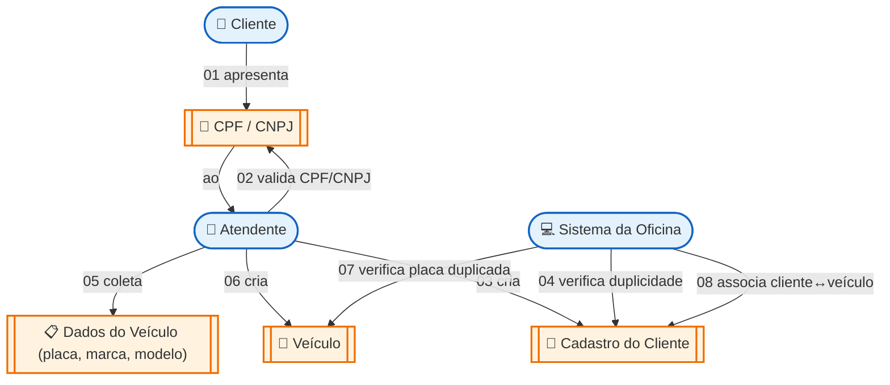
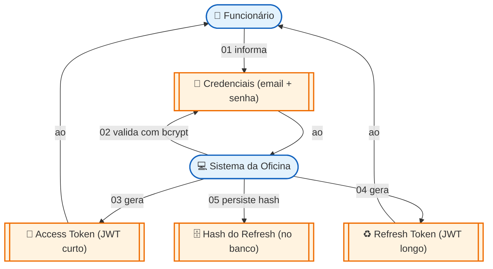
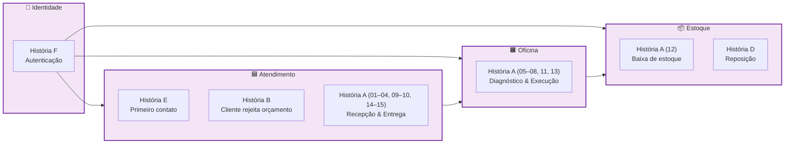

# Domain Storytelling — Oficina Mecânica

> [← Voltar ao índice](./README.md)

Toda oficina tem suas histórias. O carro chega na garagem, alguém recebe, alguém olha por baixo, alguém troca a peça, alguém entrega o veículo. O cliente paga, leva, volta meses depois com outro problema. É um vai e vem de pessoas, papéis e ferramentas que, quando contado em ordem, vira o desenho do nosso sistema.

Este documento registra essas histórias do jeito que elas acontecem no nosso domínio. Cada uma é um caminho linear — começa, segue, termina — sem desvios, sem retornos. Quando a história precisa tomar outro rumo (o cliente rejeita o orçamento, por exemplo), ela vira outra história, com começo e fim próprios.

---

## Quem participa

Antes de contar o que acontece, vale apresentar quem está em cena. A gente nomeia as pessoas pela **função** que desempenham, não pelo nome — afinal, hoje pode ser a Ana no balcão e amanhã o João, mas o papel "Atendente" continua o mesmo.

| Ator | Quem é | O que faz |
| --- | --- | --- |
| 🧑 **Cliente** | Pessoa física ou jurídica dona do veículo | Traz o carro, recebe o orçamento, decide e paga |
| 👔 **Atendente** | Funcionário da recepção | Cadastra, abre a OS, conversa com o cliente, entrega o veículo |
| 🔧 **Mecânico** | Funcionário técnico | Diagnostica o problema, monta o orçamento e executa o serviço |
| 👨‍💼 **Admin/Gerente** | Funcionário responsável pelo dia a dia | Cuida do catálogo, do estoque e dos usuários do sistema |
| 💻 **Sistema da Oficina** | A API que estamos construindo | Persiste cadastros, calcula valores, dá baixa em estoque e emite comprovantes |
| 🏭 **Fornecedor** | Parceiro externo | Repõe peças e insumos quando o estoque pede |

## O que circula entre eles

Ao longo de cada história, os atores manipulam coisas — algumas físicas (um carro, uma peça), outras digitais (um cadastro, um orçamento). Esses são os objetos de trabalho.

| Objeto | Natureza |
| --- | --- |
| 🚗 Veículo | Físico |
| 📇 Cadastro do Cliente | Digital |
| 📋 Ordem de Serviço (OS) | Digital |
| 💵 Orçamento (valor final preliminar) | Digital |
| ⚙️ Peça | Física, com reflexo no estoque |
| 🛢️ Insumo | Físico, com reflexo no estoque |
| 🔧 Serviço (do catálogo) | Digital |
| 📦 Estoque | Digital (espelho do físico) |
| 🧾 Comprovante de Entrega | Digital |
| 🔑 Credenciais (e-mail + senha) | Digital |
| 🎫 Tokens JWT | Digital |

## Como ler os diagramas

A gente usa Mermaid em vez da notação pictográfica original — fica versionável no Git e renderiza direto no GitHub. As convenções são:

- **Atores** ficam em caixas arredondadas (`([ ])`)
- **Objetos de trabalho** ficam em caixas duplas (`[[ ]]`)
- **Atividades** são setas numeradas e nomeadas com um verbo (`-- "01 entrega" -->`)
- **Anotações** vêm logo abaixo de cada diagrama, listando regras, validações e gatilhos
- **Grupos** (subdomínios) aparecem como `subgraph`

---

## História A — O cliente aprova o orçamento

Esta é a história que a gente espera que aconteça em todo atendimento. O cliente chega com um problema, recebe o diagnóstico, concorda com o valor e leva o carro consertado de volta.

**Vale anotar:**

- **02** → Se o cliente é novo, o sistema valida CPF ou CNPJ conforme o tipo (PF/PJ).
- **04** → A OS nasce com `valor_final = 0` e `status = recebida`. Ela só ganha valor quando o mecânico começa a registrar os itens.
- **08** → O valor final é a soma dos serviços, peças e insumos — sempre com o preço **histórico** registrado no momento, não o preço atual do catálogo.
- **09** → No MVP, essa comunicação ainda acontece fora do sistema (telefone, WhatsApp). O serviço de notificação está no roadmap.
- **12** → A baixa do estoque é transacional. Se algo falha, a OS e o estoque permanecem consistentes — não tem como o estoque baixar sem a OS avançar.
- **15** → O comprovante é digital; o pagamento em si ainda não foi modelado nesta fase.

---

## História B — O cliente rejeita o orçamento

Nem todo orçamento fecha. Às vezes o cliente acha caro, decide adiar, ou prefere levar pra outra oficina. Esta história começa no mesmo ponto da anterior, mas termina antes da execução — o veículo volta intacto para o dono.

**Vale anotar:**

- **04** → O status `cancelada` ainda não existe no enum atual da OS — está sugerido para a próxima sprint. Por ora, OSs rejeitadas ficam paradas em `aguardando_aprovacao`.
- **05** → Nada é debitado do estoque, porque a execução nunca começou. O orçamento previa, mas não consumiu.
- A OS rejeitada **não vira** uma OS aceita depois. Se o cliente mudar de ideia, abre-se uma nova OS do zero.

---

## História D — Reposição do estoque

Peça e insumo se gastam. Quando a quantidade disponível chega no limite, alguém precisa correr atrás do fornecedor antes que falte na hora do serviço.

**Vale anotar:**

- **01** → O alerta automático ainda não existe; hoje o Admin precisa olhar a listagem manualmente. Faz parte do módulo de Relatórios planejado.
- **03** → A comunicação com o fornecedor é totalmente offline (telefone, e-mail). Integração direta é roadmap futuro.
- **06** → A entrada é manual: o Admin abre o cadastro da peça/insumo e ajusta a quantidade. Auditoria dessa operação fica registrada via `criado_em`/`atualizado_em`.

---

## História E — O primeiro contato

Quando o cliente nunca veio aqui antes, é preciso criar tudo do zero: o cadastro do cliente e o cadastro do veículo. Essa história é um detalhamento dos passos 02 e 03 da História A — quando a gente abre o "como cadastra um cliente novo".

**Vale anotar:**

- **02** → A validação acontece no `cpf-cnpj.validator.ts`. O tipo informado pelo cliente (PF ou PJ) define qual algoritmo de dígito verificador rodar.
- **04** e **07** → Documento e placa são únicos no sistema — o cadastro falha se já existirem ativos.
- **08** → A relação cliente ↔ veículo é N:N. Um carro pode passar pela oficina com donos diferentes ao longo dos anos, e cada um fica registrado.

---

## História F — Funcionário entrando no sistema

Antes de qualquer atendimento começar, o funcionário precisa se identificar. Esta é a história mais curta do conjunto, mas atravessa todas as outras: sem ela, nenhuma das anteriores acontece.

**Vale anotar:**

- **02** → A senha nunca chega ao banco em texto plano — a comparação é feita com `bcrypt.compare` contra o hash armazenado.
- **05** → Só o **hash** do refresh token vai pro banco. Isso permite revogar uma sessão (logout) e fazer rotação a cada renovação, sem nunca expor o token cru.
- O funcionário guarda os tokens no cliente (header `Authorization: Bearer ...`); o servidor não mantém sessão.

---

## Como as histórias se encaixam nos bounded contexts

Cada história vive em um ou mais contextos delimitados do domínio. O diagrama abaixo mostra onde cada uma toca:

A Identidade é transversal — sustenta as outras três. O fluxo natural do negócio segue da esquerda para a direita: o atendimento abre a OS, a oficina executa, o estoque acompanha o que sai. A reposição (História D) alimenta o estoque por fora desse fluxo principal, mas no mesmo contexto.

---

## Quem contou essas histórias — Grupo 66

A narrativa acima foi construída em conjunto pela equipe do Grupo 66:

| Integrante | Papel na construção |
| --- | --- |
| Nayara | Domain Expert / Modeladora |
| Pedro | Domain Expert / Modelador |
| Matheus | Domain Expert / Moderador |
| Guilherme | Domain Expert / Ouvinte |
| Aléxia | Domain Expert / Ouvinte |

Os papéis circularam entre as sessões — todo mundo contou parte da história, todo mundo desenhou em algum momento.

---

## Referências

- HOFER, S.; SCHWENTNER, H. *Domain Storytelling: A Collaborative, Visual, and Agile Way to Build Domain-Driven Software*. Addison-Wesley, 2021.
- COCKBURN, A. *Writing Effective Use Cases*. Addison-Wesley, 2001.
- EVANS, E. *Domain-Driven Design: Tackling Complexity in the Heart of Software*. Pearson Education, 2003.
- [Board de Event Storming / DDD no Miro](https://miro.com/app/board/uXjVHPI3bCE=/) — modelagem que originou estas histórias.
- [Linguagem Ubíqua](./03-linguagem-ubiqua.md) — dicionário dos termos usados aqui.
- [egon.io](https://egon.io) — ferramenta de referência para diagramas pictográficos de Domain Storytelling.
