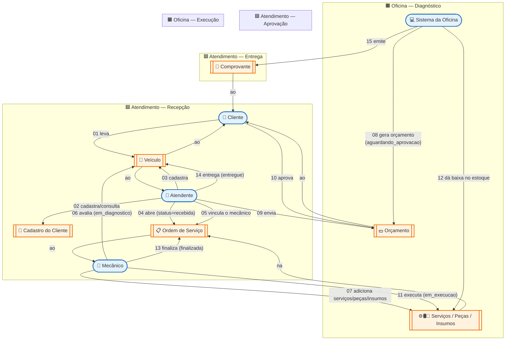
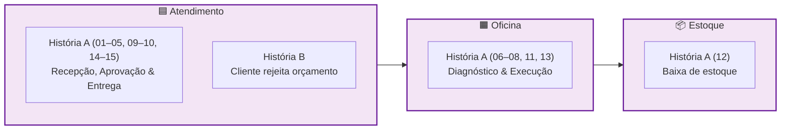

# Domain Storytelling — Oficina Mecânica

> [← Voltar ao índice](./README.md)

## Quem participa

Nomeamos as pessoas pela **função**, não pelo nome — hoje pode ser a Ana no balcão e amanhã o João, mas o papel "Atendente" continua o mesmo.

| Ator | O que faz |
| --- | --- |
| 🧑 **Cliente** | Traz o carro, recebe o orçamento, decide e paga |
| 👔 **Atendente** | Cadastra, abre a OS, conversa com o cliente, entrega o veículo |
| 🔧 **Mecânico** | Diagnostica o problema, monta o orçamento e executa o serviço |
| 💻 **Sistema da Oficina** | Persiste cadastros, calcula valores, dá baixa no estoque e emite comprovantes |

## O que circula entre eles

| Objeto | Natureza |
| --- | --- |
| 🚗 Veículo | Físico |
| 📇 Cadastro do Cliente | Digital |
| 📋 Ordem de Serviço (OS) | Digital |
| 💵 Orçamento | Digital |
| ⚙️🛢️🔧 Peças / Insumos / Serviços | Peça e insumo são físicos (refletem no estoque); serviço é catálogo digital |
| 📦 Estoque | Digital, espelho do físico |
| 🧾 Comprovante de Entrega | Digital |

---

## História A — O cliente aprova o orçamento

Esta é a história que a gente espera que aconteça em todo atendimento. O cliente chega com um problema, recebe o diagnóstico, concorda com o valor e leva o carro consertado de volta.

**Vale anotar:**

- **02** → Se o cliente é novo, o sistema valida CPF ou CNPJ conforme o tipo (PF/PJ).
- **04–05** → No sistema, **abrir a OS e vincular o mecânico acontecem juntos**: o endpoint `POST /ordens-servico` exige o `mecanicoId` na criação. Por isso é o **Atendente** quem designa o mecânico ao abrir a OS — não há atribuição automática pelo sistema em etapa separada.
- **04** → A OS nasce com `valor_final = 0`; só ganha valor quando o mecânico registra os itens.
- **08** → O valor final usa o preço **histórico** dos itens, não o do catálogo atual.
- **09** → A comunicação acontece fora do sistema no MVP (telefone, WhatsApp); notificação está no roadmap.
- **12** → A baixa incide na quantidade em estoque das próprias **peças/insumos** (`qtdEstoque`) — não há entidade `Estoque` separada. A operação é transacional, mantendo OS e estoque consistentes.
- **15** → O comprovante é digital; o pagamento em si não foi modelado nesta fase.

---

## História B — O cliente rejeita o orçamento

Nem todo orçamento fecha. Esta história começa no mesmo ponto da anterior, mas termina antes da execução: o veículo volta intacto para o dono.

**Vale anotar:**

- **04** → O status `cancelada` ainda não existe no enum atual; está sugerido para a próxima sprint. Por ora, OSs rejeitadas ficam em `aguardando_aprovacao`.
- **05** → Nada é debitado do estoque — o orçamento previa, mas a execução nunca começou.
- A OS rejeitada **não vira** uma OS aceita depois: se o cliente mudar de ideia, abre-se uma nova.

---

## Como as histórias se encaixam nos bounded contexts

A História A atravessa três contextos delimitados; a B vive inteira no Atendimento.

Quando o cliente aceita, o fluxo segue da esquerda para a direita: Atendimento abre a OS, Oficina executa, Estoque registra a baixa. Quando rejeita, nada chega à Oficina nem ao Estoque — a OS é encerrada na recepção.

---

## Referências

- HOFER, S.; SCHWENTNER, H. *Domain Storytelling: A Collaborative, Visual, and Agile Way to Build Domain-Driven Software*. Addison-Wesley, 2021.
- COCKBURN, A. *Writing Effective Use Cases*. Addison-Wesley, 2001.
- EVANS, E. *Domain-Driven Design: Tackling Complexity in the Heart of Software*. Pearson Education, 2003.
- [Board de Event Storming / DDD no Miro](https://miro.com/app/board/uXjVHPI3bCE=/) — modelagem que originou estas histórias.
- [Linguagem Ubíqua](./03-linguagem-ubiqua.md) — dicionário dos termos usados aqui.
- [egon.io](https://egon.io) — ferramenta de referência para diagramas pictográficos de Domain Storytelling.
